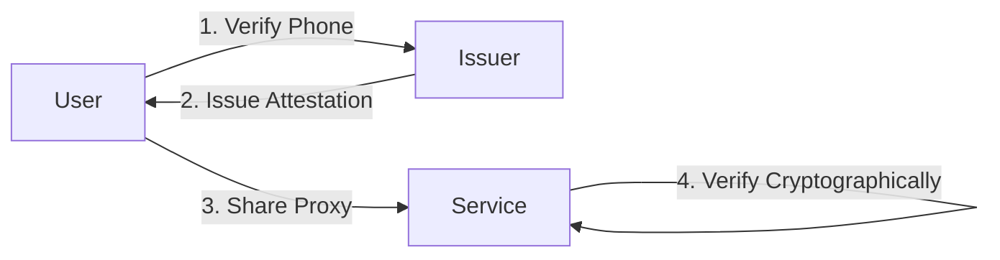

# Hesha Protocol

> ⚠️ **ALPHA SOFTWARE**: This is a preview release for early feedback. NOT production ready. APIs may change.

> Privacy-preserving phone number proxies through cryptographic attestations

[](https://opensource.org/licenses/MIT)
[](https://www.rust-lang.org/)
[](docs/whitepaper.md)

## What is Hesha?

Hesha is a decentralized protocol that lets users prove they own a phone number without revealing it. Instead of sharing your real phone number with every service, you get a cryptographically verifiable proxy number that preserves your privacy.

### The Problem

- 📱 **Privacy Risk**: Every app wants your phone number
- 🎯 **Data Breaches**: Phone numbers in databases get leaked
- 🔗 **Cross-Service Tracking**: Same number links your identity everywhere
- 😔 **No Alternative**: Even privacy apps like Signal need your real number

### The Solution

Hesha introduces **proxy phone numbers** - numbers that look like `+10012345678` but are cryptographically tied to your real number without revealing it.

```
Your real number: +1 (555) 123-4567
Your proxy number: +10012345678
```

Services can verify you own a real phone number, but they never see it.

## How It Works



1. **One-time verification**: Prove phone ownership to an issuer (via SMS/call)
2. **Get attestation**: Receive a cryptographically signed proxy number
3. **Use everywhere**: Share your proxy instead of your real number
4. **Offline verification**: Services verify without contacting anyone


## Architecture

### Core Components

- **Protocol Specification** ([docs](docs/hesha-protocol-specification.md)) - The core protocol definition
- **Issuer Nodes** - Services that verify phone ownership and issue attestations
- **Wallets** - Apps that store attestations and handle verification
- **Service Libraries** - SDKs for accepting proxy numbers

### Key Features

✅ **Privacy First** - Real numbers never shared  
✅ **Decentralized** - No central authority  
✅ **Offline Verification** - No API calls needed  
✅ **User Control** - Explicit consent for each use  
✅ **Standard Crypto** - Ed25519, SHA-256, JWT  

## Documentation

- 📄 [Whitepaper](docs/whitepaper.md) - Academic paper with security proofs
- 🔧 [Protocol Specification](docs/hesha-protocol-specification.md) - Technical details
- 🖼️ [Sequence Diagrams](docs/sequence-diagrams.md) - Visual protocol flows
- 🏗️ [Issuer Specification](docs/hesha-issuer-node-specification.md) - Running an issuer
- 📱 [Wallet Specification](docs/hesha-wallet-technical-specification.md) - Building a wallet

## Project Structure

```
hesha/
├── crates/
│   ├── hesha-types/      # Core protocol types
│   ├── hesha-crypto/     # Cryptographic operations
│   ├── hesha-core/       # Protocol logic
│   └── hesha-client/     # HTTP client
├── nodes/
│   └── issuer-node/      # Reference issuer implementation
├── cli/
│   └── hesha-cli/        # Command-line tool
├── docs/                 # Specifications and documentation
└── scripts/              # Development scripts
```

## Use Cases

### 🔒 Privacy-Focused Apps
Replace phone number requirements with proxy numbers

### 💸 Crypto Transactions
Share proxy numbers instead of wallet addresses

### 🛍️ Online Marketplaces
Enable buyer-seller communication without phone exposure

### 👥 Social Platforms
Prevent phone number harvesting and spam

## 🚧 Development Status

**Current Status: ALPHA PREVIEW (v1.1-alpha)**

- ✅ Core protocol implemented
- ✅ Reference implementation complete
- ✅ Basic testing coverage
- ⚠️ NOT production ready
- ⚠️ APIs may change
- ⚠️ Security audit pending
- ⚠️ Limited real-world testing

### What We Need From Early Adopters

- 🐛 Bug reports
- 💡 API feedback
- 📖 Documentation improvements
- 🔧 Integration experiences
- 🔒 Security reviews

### Roadmap to Beta

- [ ] Community feedback incorporation
- [ ] Security audit
- [ ] Performance optimization
- [ ] Additional test coverage
- [ ] Production hardening

## Development

### Prerequisites

- Rust 1.70+ ([install](https://rustup.rs/))
- OpenSSL development headers

### Building from Source

```bash
# Clone repository
git clone https://github.com/hesha-protocol/hesha.git
cd hesha

# Build all components
cargo build --release

# Run tests
cargo test

# Run specific component
cargo run -p issuer-node
```

### Running an Issuer

```bash
# Generate issuer keys
./target/release/hesha keygen -o issuer-keys.json

# Start issuer node
./target/release/issuer-node --config config.toml
```

See [Issuer Setup Guide](docs/ISSUER_SETUP.md) for production deployment.

## Contributing

We welcome contributions! Please see our [Contributing Guidelines](CONTRIBUTING.md).

### Ways to Contribute

- 🐛 Report bugs and issues
- 💡 Suggest new features
- 📝 Improve documentation
- 🔧 Submit pull requests
- 🌍 Translate documentation
- 🔒 Security reviews

### Development Process

1. Fork the repository
2. Create a feature branch (`git checkout -b feature/amazing-feature`)
3. Commit changes (`git commit -m 'Add amazing feature'`)
4. Push to branch (`git push origin feature/amazing-feature`)
5. Open a Pull Request

## Security

Hesha uses industry-standard cryptography:
- **Ed25519** for digital signatures
- **SHA-256** for hashing
- **JWT** for attestation format

For security issues, please email security@hesha.org (i haven't set this up just yet)(PGP key in [SECURITY.md](SECURITY.md)).

- 🌐 [Website](https://hesha.org) - Project homepage

## License

This project is licensed under the MIT License - see the [LICENSE](LICENSE) file for details.

## Acknowledgments

- Built with [Rust](https://www.rust-lang.org/) and love
- Cryptography by [ed25519-dalek](https://github.com/dalek-cryptography/ed25519-dalek)

---

<p align="center">
  <strong>Privacy is not about hiding, it's about choosing what to share.</strong>
</p>

<p align="center">
  Made with ❤️ by privacy advocates worldwide
</p>