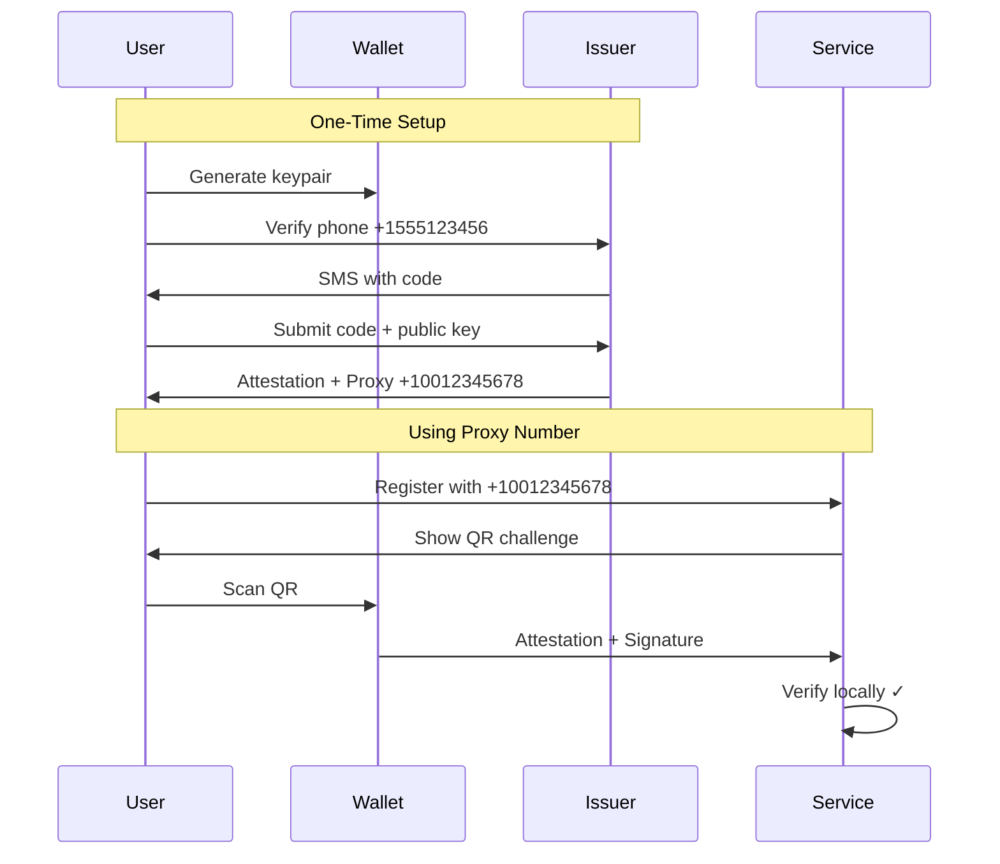

# Hesha Protocol: Privacy-Preserving Phone Number Proxies

## Executive Summary

Hesha is a decentralized protocol that enables users to prove phone number ownership without revealing their actual phone numbers. Through cryptographically verifiable proxy numbers, users can authenticate with services while maintaining complete privacy.

### Key Innovation
- **Proxy Numbers**: Phone numbers like `+10012345678` that cryptographically represent real numbers
- **Zero Phone Exposure**: Services never see or store real phone numbers
- **Offline Verification**: After initial key discovery, no network calls needed
- **User Sovereignty**: Users control when and how their identity is verified

## 1. The Problem

### 1.1 Phone Numbers as Universal Identifiers

In today's digital ecosystem, phone numbers have become the de facto standard for user authentication:

```
Current State:
┌─────────────┐      Real Phone      ┌─────────────┐
│    User     │ ──────────────────> │  Service A  │
│ +1555123456 │ ──────────────────> │  Service B  │
└─────────────┘ ──────────────────> │  Service C  │
                                     └─────────────┘
                    
Problems:
❌ Privacy violation - real number exposed everywhere
❌ Spam & harassment - anyone can contact you
❌ Data breaches - phone numbers leaked in hacks
❌ Cross-service tracking - same ID links all accounts
```

### 1.2 Current Solutions Fall Short

| Solution | Problem |
|----------|---------|
| Burner Numbers | Not persistent, often blocked |
| VoIP Numbers | Detected and rejected by services |
| Email Only | No Sybil resistance |
| Privacy Apps | Still require real phone numbers |

## 2. The Hesha Solution

### 2.1 Core Concept

Hesha introduces **cryptographically verifiable proxy numbers** that prove phone ownership without revealing the actual number:

```
With Hesha:
┌─────────────┐      Proxy Number    ┌─────────────┐
│    User     │ ──────────────────> │  Service A  │
│ Real Phone: │      +10012345678    │  Service B  │
│ +1555123456 │ ──────────────────> │  Service C  │
└─────────────┘  (Never Revealed)    └─────────────┘

✅ Privacy preserved - real number stays secret
✅ Verifiable - cryptographic proof of ownership  
✅ Persistent - same proxy works everywhere
✅ User-controlled - explicit consent required
```

### 2.2 How It Works



## 3. Technical Architecture

### 3.1 Cryptographic Foundation

Hesha uses industry-standard cryptography:

| Component | Technology | Purpose |
|-----------|------------|---------|
| Signatures | Ed25519 | Attestation signing & verification |
| Hashing | SHA-256 | Phone number privacy |
| Attestations | JWT | Standard token format |
| Key Discovery | HTTPS + DNS | Decentralized trust |

### 3.2 Proxy Number Generation

Proxy numbers are generated deterministically:

```
Input: phone + user_pubkey + issuer + scope + nonce
         ↓
Hash: SHA-256
         ↓
Extract: Decimal digits
         ↓
Format: +{country_code}00{digits}
         ↓
Result: +10012345678
```

**Properties:**
- ✅ Deterministic - Same inputs = same proxy
- ✅ Unpredictable - Can't guess from phone number
- ✅ Collision-free - 128-bit nonce ensures uniqueness
- ✅ E.164 compliant - Works with existing systems

### 3.3 Attestation Structure

```javascript
{
  // Standard JWT claims
  "iss": "issuer.example.com",     // Issuer domain
  "sub": "+10012345678",           // Proxy number
  "iat": 1720000000,               // Issued at
  "exp": 1751536000,               // Expires in 1 year
  
  // Hesha-specific claims
  "phone_hash": "sha256:a1b2c3...", // Hash of real number
  "user_pubkey": "Ed25519_key...",  // User's public key
  "binding_proof": "sig:x1y2z3...", // Cryptographic binding
  "nonce": "0123456789abcdef..."    // Generation nonce
}
```

### 3.4 Dual-Signature Verification

Every verification requires two signatures:

```
1. Issuer Signature (on attestation)
   └─> Proves: Proxy number is legitimate
   
2. User Signature (on challenge)
   └─> Proves: User consents to this verification
```

This ensures:
- ✅ Attestations can't be forged
- ✅ Users maintain control
- ✅ No verification without consent

## 4. Protocol Flows

### 4.1 Getting a Proxy Number

```
Step 1: Generate Identity
┌──────────┐
│  Wallet  │ → Generate Ed25519 keypair
└──────────┘   (Private key never leaves device)

Step 2: Phone Verification  
┌──────────┐     Phone + Public Key    ┌──────────┐
│   User   │ ─────────────────────────>│  Issuer  │
└──────────┘                           └──────────┘
                    SMS Code
            <─────────────────────────

Step 3: Receive Attestation
┌──────────┐     Attestation JWT      ┌──────────┐
│  Wallet  │ <───────────────────────│  Issuer  │
└──────────┘   + Proxy: +10012345678  └──────────┘
```

### 4.2 Using Your Proxy Number

```
Step 1: Provide Proxy
┌──────────┐      +10012345678       ┌──────────┐
│   User   │ ───────────────────────>│ Service  │
└──────────┘                         └──────────┘

Step 2: Verification Challenge
┌──────────┐      QR Code/Link       ┌──────────┐
│   User   │ <───────────────────────│ Service  │
└──────────┘    with challenge       └──────────┘

Step 3: User Approval
┌──────────┐     Scan & Approve      ┌──────────┐
│  Wallet  │ ───────────────────────>│   User   │
└──────────┘                         └──────────┘

Step 4: Cryptographic Response
┌──────────┐   Attestation + Sig     ┌──────────┐
│  Wallet  │ ───────────────────────>│ Service  │
└──────────┘                         └──────────┘
                                            ↓
                                     Verify Locally ✓
```

## 5. Security Analysis

### 5.1 Threat Model

| Threat | Protection |
|--------|------------|
| Attestation Forgery | Ed25519 signatures unforgeable without private key |
| Phone Number Recovery | SHA-256 hash is one-way, phone number unrecoverable |
| Replay Attacks | Fresh nonces + timestamps prevent replay |
| Man-in-the-Middle | HTTPS + signature verification |
| Issuer Compromise | Limited damage - can't forge user signatures |

### 5.2 Privacy Properties

```
What Services See:          What Services DON'T See:
✓ Proxy number             ✗ Real phone number
✓ Cryptographic proof      ✗ Personal information  
✓ User's public key        ✗ Location data
✓ Issuer domain           ✗ Call/SMS history
```

### 5.3 Trust Model

```
Distributed Trust:
┌─────────────┐
│   Users     │ ← Choose which issuers to trust
└─────────────┘
       ↓
┌─────────────┐
│  Issuers    │ ← Verify phones, sign attestations
└─────────────┘
       ↓
┌─────────────┐
│  Services   │ ← Choose which issuers to accept
└─────────────┘

No central authority required!
```

## 6. Implementation

### 6.1 For Services (Accept Proxy Numbers)

```javascript
// 1. Detect proxy numbers
function isProxyNumber(phone) {
  return /^\+\d{1,4}00\d+$/.test(phone);
}

// 2. Create verification challenge
const challenge = {
  service_id: "app.example.com",
  nonce: generateNonce(),
  timestamp: Date.now(),
  callback_url: "https://app.example.com/verify"
};

// 3. Verify response
async function verifyProxy(attestation, signature) {
  // Verify issuer signature
  const issuerKey = await fetchIssuerKey(attestation.iss);
  const validAttestation = verifyJWT(attestation, issuerKey);
  
  // Verify user signature  
  const userKey = attestation.user_pubkey;
  const validConsent = verifySignature(challenge, signature, userKey);
  
  return validAttestation && validConsent;
}
```

### 6.2 For Wallets (Manage Identities)

```rust
// Generate user identity
let keypair = generate_keypair();
let public_key = keypair.public;

// Request attestation
let attestation = issuer.attest(
    phone_number,
    public_key,
    country_code
).await?;

// Sign verification challenges
let signature = sign_challenge(
    challenge,
    keypair.private
);
```

### 6.3 For Issuers (Issue Attestations)

```rust
// Verify phone ownership
verify_phone_ownership(phone_number).await?;

// Generate proxy number
let proxy = generate_proxy_number(
    phone_number,
    user_pubkey,
    issuer_domain,
    scope,
    nonce
);

// Create attestation
let attestation = create_jwt(Claims {
    sub: proxy,
    phone_hash: hash_phone(phone_number),
    user_pubkey,
    binding_proof: create_binding_proof(...),
    // ... other claims
});
```

## 7. Offline Verification

### 7.1 The Magic of Offline Verification

After fetching an issuer's public key once, services can verify unlimited attestations offline:

```
First Time:
Service → Internet → Issuer's public key → Cache

After That:
Service → Local verification only!
         ↓
   Microseconds
   No API calls
   No latency
   No downtime
   No tracking
```

### 7.2 Scale Implications

Traditional phone verification:
- API call to SMS gateway: ~500ms
- Cost per verification: $0.01-0.05
- Rate limits apply
- Downtime affects service

Hesha verification:
- Local computation: ~50μs (10,000x faster!)
- Cost per verification: $0
- No rate limits
- Works offline

## 8. Use Cases

### 8.1 Privacy-First Messaging
```
Signal/WhatsApp but without phone exposure:
- Register with proxy number
- Find contacts via proxy numbers  
- Real numbers never shared
```

### 8.2 Crypto Transactions
```
Share proxy instead of wallet address:
- Human-readable: +10012345678
- Multi-chain support in attestation
- Built-in identity verification
```

### 8.3 Online Marketplaces
```
Buyer ←→ Seller communication:
- Both use proxy numbers
- No phone harassment after sale
- Trust through verification
```

### 8.4 Dating Apps
```
Match and chat safely:
- Verify real person (has phone)
- Never expose actual number
- Block without consequences
```

## 9. Comparison

| Feature | Traditional | Hesha |
|---------|-------------|--------|
| Privacy | ❌ Real number exposed | ✅ Proxy only |
| Verification Speed | ~500ms (API) | ~50μs (local) |
| Offline Support | ❌ Requires network | ✅ Works offline |
| Cost | $0.01-0.05/verify | $0 |
| User Control | ❌ Service owns data | ✅ User owns keys |
| Decentralized | ❌ SMS gateways | ✅ Multiple issuers |

## 10. Getting Started

### For Developers

```bash
# Install SDK
npm install @hesha/sdk

# Verify a proxy number
import { verifyProxy } from '@hesha/sdk';

const isValid = await verifyProxy(
  proxyNumber,
  attestation,
  userSignature
);
```

### For Users

1. Download a Hesha wallet
2. Verify your phone once
3. Use your proxy everywhere
4. Stay private forever

### For Issuers

```bash
# Run an issuer node
docker run -p 3000:3000 hesha/issuer-node

# Configure verification method
VERIFY_METHOD=twilio # or nexmo, sns, etc
```

## 11. Roadmap

### Phase 1: Foundation ✅
- [x] Protocol specification
- [x] Reference implementation
- [x] Basic tooling

### Phase 2: Ecosystem 🚧
- [ ] Mobile wallets (iOS/Android)
- [ ] Browser extension
- [ ] Popular language SDKs
- [ ] Integration guides

### Phase 3: Adoption 📋
- [ ] Major app integrations
- [ ] Issuer network growth
- [ ] Developer tools
- [ ] Security audit

### Phase 4: Innovation 🔮
- [ ] Zero-knowledge proofs
- [ ] Cross-chain identity
- [ ] Decentralized issuance
- [ ] W3C DID integration

## 12. Conclusion

Hesha makes phone verification private, fast, and user-controlled. By separating identity verification from identity disclosure, we can have both security and privacy.

**The future is private by default.**

---

## Resources

- 📄 [Technical Specification](docs/hasha-protocol-specification.md)
- 🔧 [Implementation Guide](docs/implementation-guide.md)
- 👥 [Community Discord](https://discord.gg/hesha)
- 💻 [GitHub](https://github.com/hesha-protocol/hesha)

---

*"Privacy is not about hiding, it's about choosing what to share."*