# Hesha Protocol Sequence Diagrams

**Author**: Bernard Parah

## Table of Contents

### Issuance Flow
1. [Step 1: User Keypair Generation](#step-1-user-keypair-generation)
2. [Step 2: Phone Verification Request](#step-2-phone-verification-request)
3. [Step 3: OTP Verification](#step-3-otp-verification)
4. [Step 4: Proxy Number Generation](#step-4-proxy-number-generation)
5. [Step 5: Attestation Creation](#step-5-attestation-creation)
6. [Step 6: Saving to Wallet](#step-6-saving-to-wallet)

### Verification Flow
7. [Step 7: Service Integration - Initial Setup](#step-7-service-integration-initial-setup)
8. [Step 8: User Registration with Proxy](#step-8-user-registration-with-proxy)
9. [Step 9: Challenge Creation](#step-9-challenge-creation)
10. [Step 10: Wallet Interaction](#step-10-wallet-interaction)
11. [Step 11: Verification Process](#step-11-verification-process)
12. [Step 12: Offline Verification](#step-12-offline-verification)

### System Overview
13. [Complete System Flow](#complete-system-flow)

---

## Issuance Flow

### Step 1: User Keypair Generation

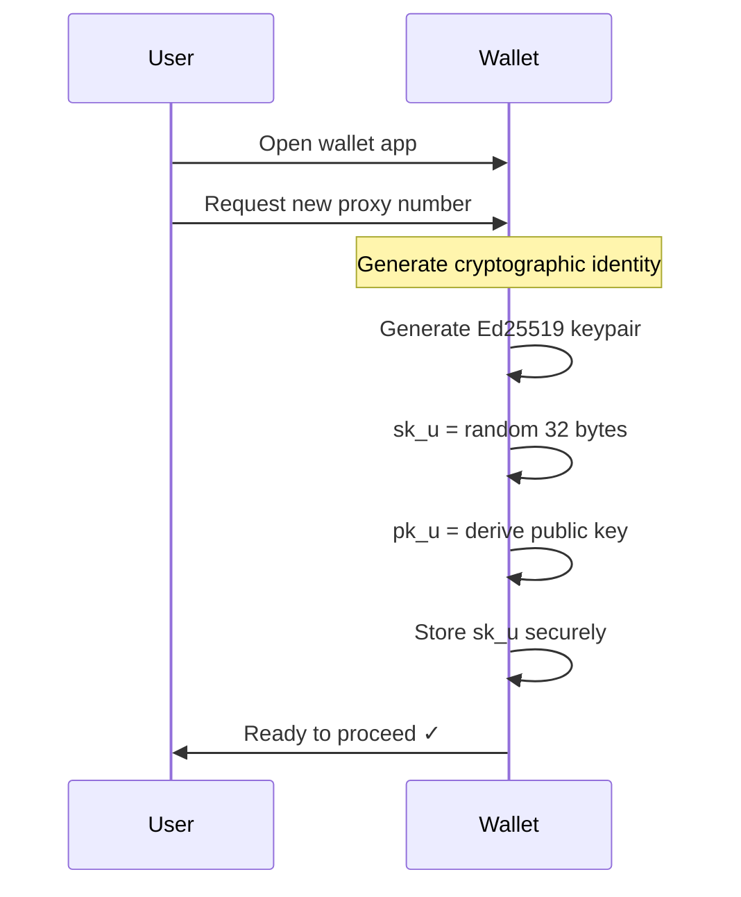

### Step 2: Phone Verification Request

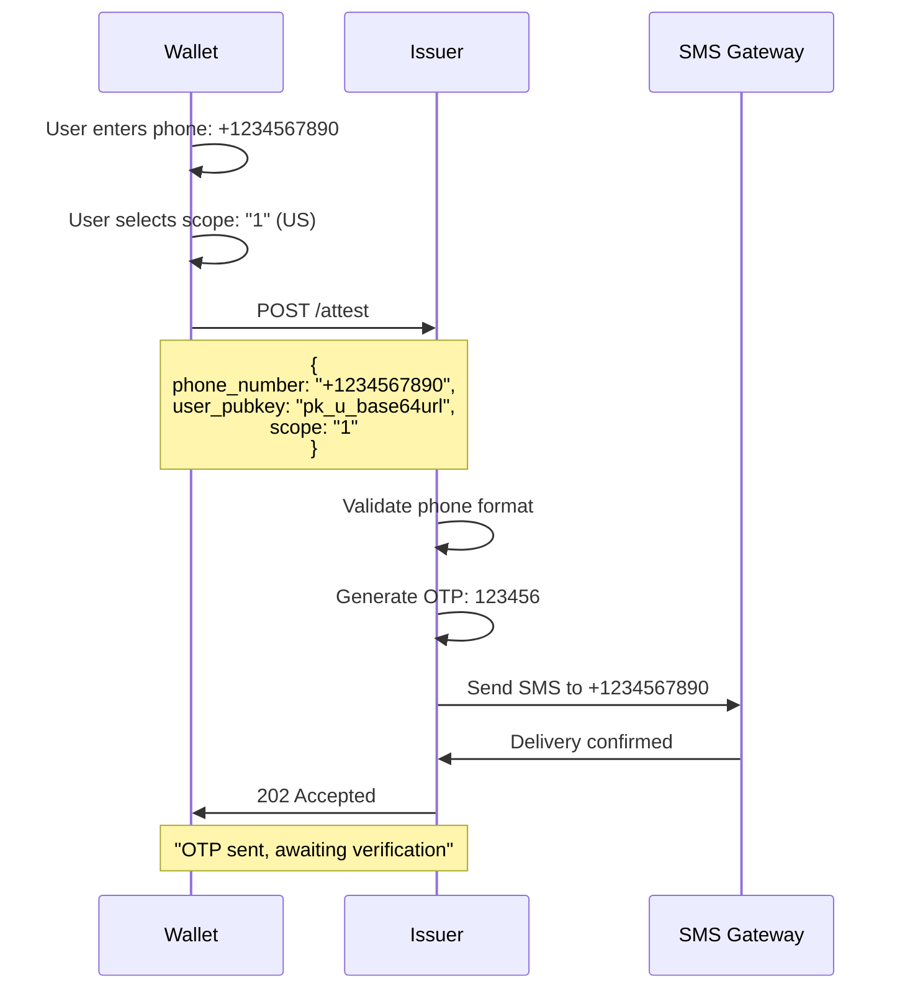

### Step 3: OTP Verification

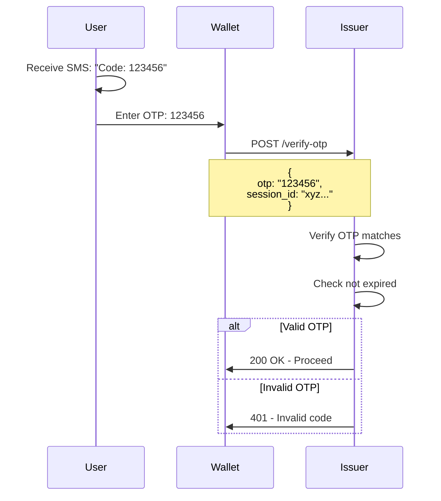

### Step 4: Proxy Number Generation

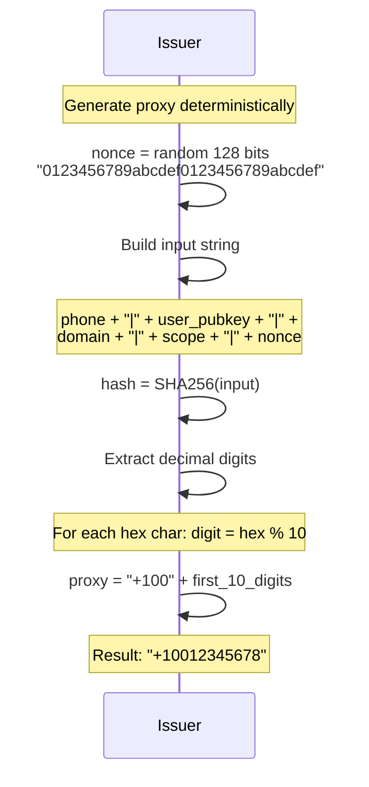

### Step 5: Attestation Creation

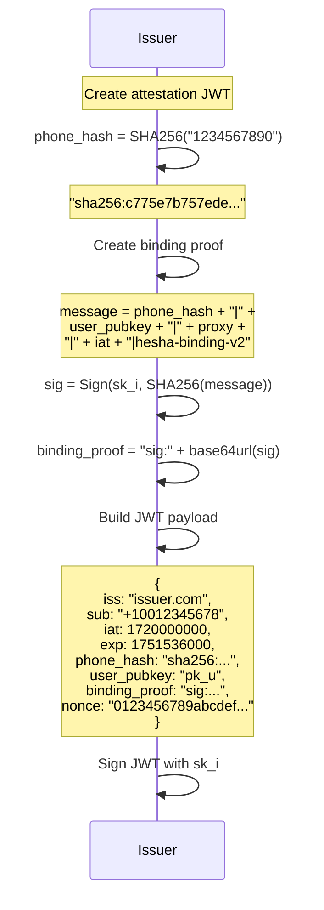

### Step 6: Saving to Wallet

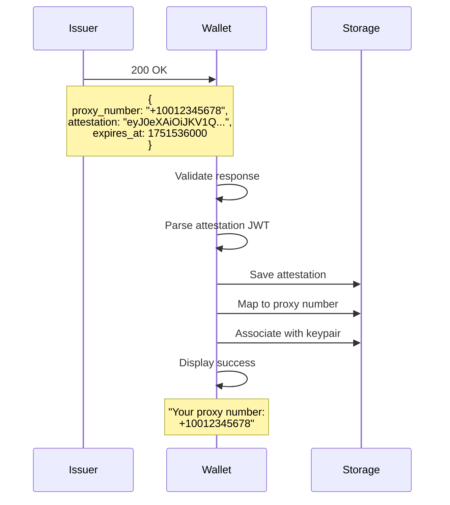

---

## Verification Flow

### Step 7: Service Integration - Initial Setup

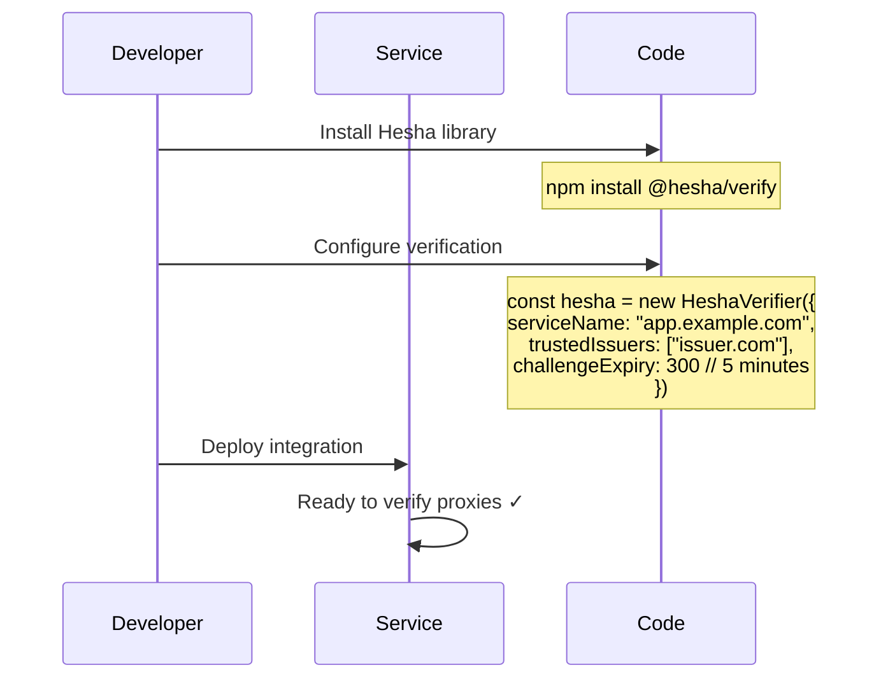

### Step 8: User Registration with Proxy

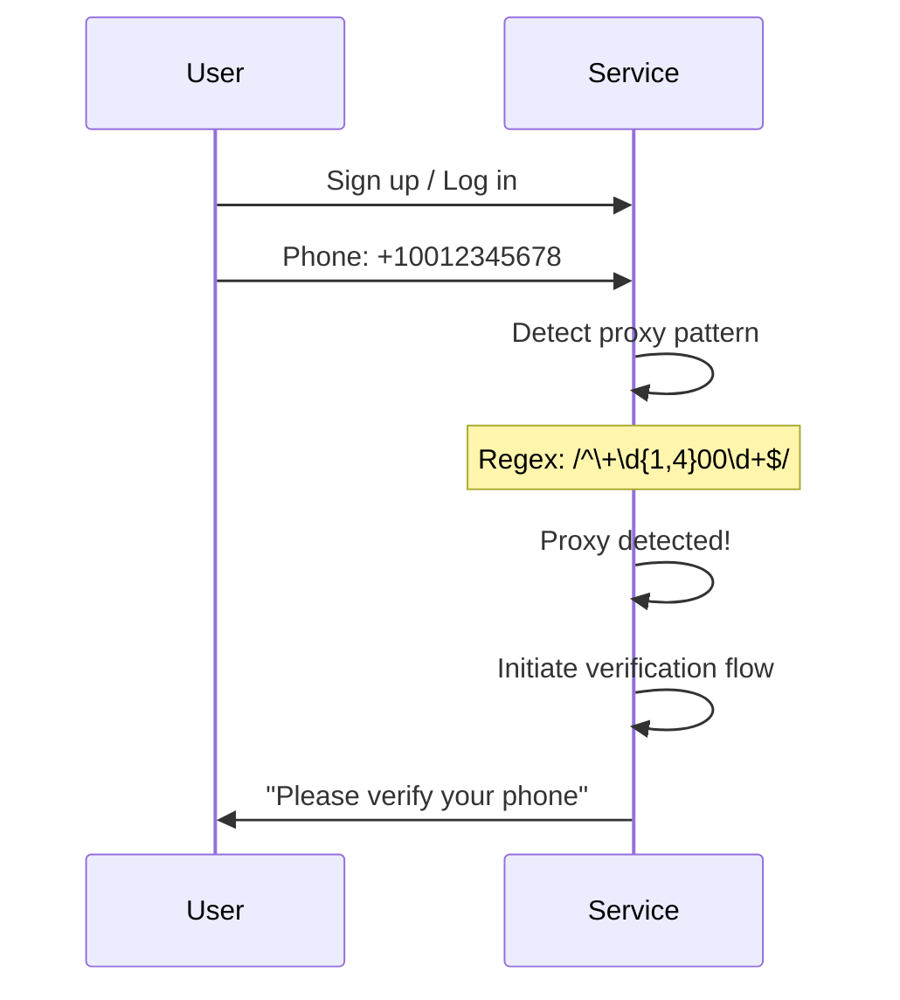

### Step 9: Challenge Creation

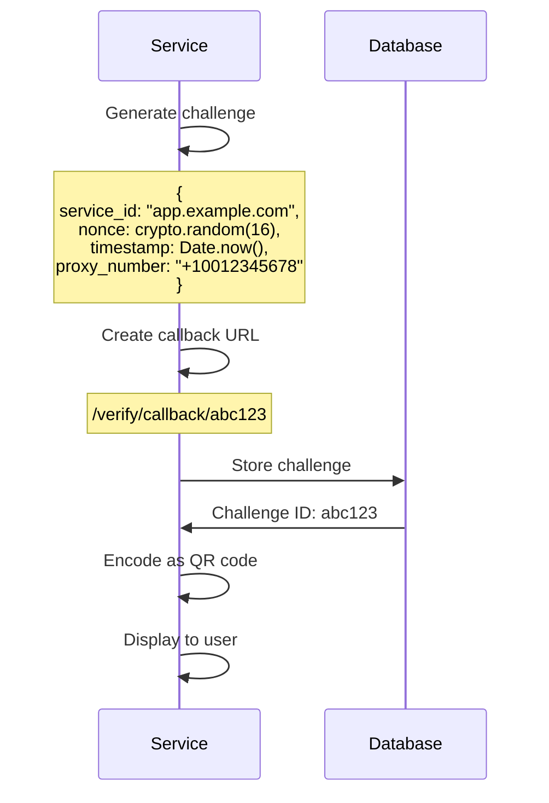

### Step 10: Wallet Interaction

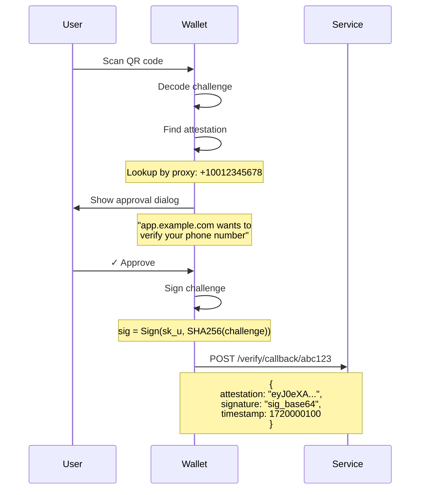

### Step 11: Verification Process

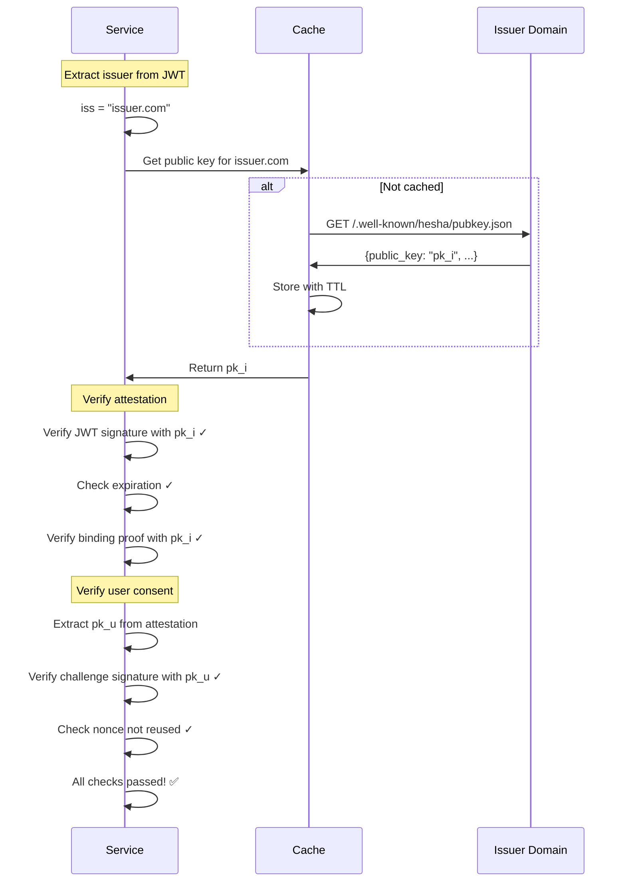

### Step 12: Offline Verification

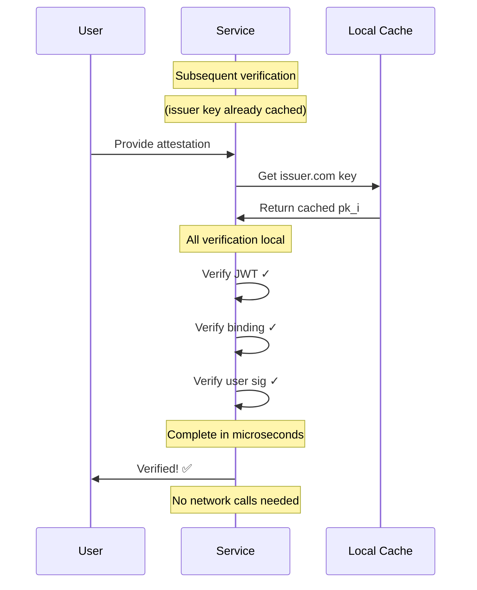

---

## System Overview

### Complete System Flow

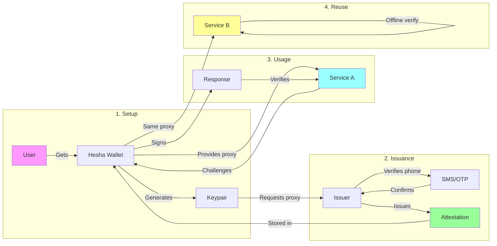

## Key Points

1. **One-time issuance**: Users verify their phone once, get permanent proxy
2. **Per-service consent**: Each service requires explicit user approval
3. **Offline capability**: After first key fetch, no network needed
4. **Privacy preserved**: Real numbers never shared with services
5. **User control**: Wallet manages all cryptographic operations