# The Hesha Protocol: Privacy-Preserving Phone Number Verification Through Cryptographic Proxy Numbers

**Version 1.1**  
**August 2025**
**Author**: Bernard Parah

## Abstract

Phone numbers have become de facto digital identifiers, required by countless services from messaging apps to financial institutions. However, sharing your real phone number exposes you to privacy risks, spam, and potential surveillance. The Hesha Protocol introduces cryptographically provable proxy phone numbers that allow users to verify phone ownership without revealing their actual number. Through a novel combination of deterministic proxy generation, Ed25519 signatures, and JWT attestations, Hesha enables privacy-preserving verification that works with existing systems. This paper presents the complete protocol design, cryptographic foundations, and implementation guidance.

## Table of Contents

1. [Introduction](#1-introduction)
2. [The Problem](#2-the-problem)
3. [Protocol Overview](#3-protocol-overview)
4. [Cryptographic Design](#4-cryptographic-design)
5. [Proxy Number Generation](#5-proxy-number-generation)
6. [Attestation Structure](#6-attestation-structure)
7. [Verification Flow](#7-verification-flow)
8. [Security Analysis](#8-security-analysis)
9. [Implementation Guide](#9-implementation-guide)
10. [Real-World Applications](#10-real-world-applications)
11. [Future Work](#11-future-work)
12. [Conclusion](#12-conclusion)

---

## 1. Introduction

### 1.1 Motivation

In our digital age, phone numbers serve multiple critical functions:
- **Identity verification**: Proving you're a real person
- **Account recovery**: Regaining access when passwords are forgotten  
- **Two-factor authentication**: Securing sensitive accounts
- **Communication**: Staying connected with services and people

Yet every time we share our phone number, we expose ourselves to:
- **Privacy invasion**: Companies building profiles and selling data
- **Spam and harassment**: Unwanted calls and messages
- **SIM swap attacks**: Account takeovers through carrier social engineering
- **Cross-service tracking**: Phone numbers used to link identities across platforms

### 1.2 The Hesha Solution

The Hesha Protocol enables users to:
1. **Verify phone ownership once** with a trusted issuer
2. **Receive a proxy phone number** that looks and acts like a regular number
3. **Share the proxy number** instead of their real number
4. **Maintain privacy** while satisfying verification requirements

Think of it as a P.O. Box for your phone number - mail (verification) goes through, but your home address (real number) stays private.

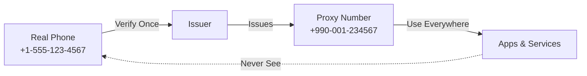

---

## 2. The Problem

### 2.1 Current State of Phone Verification

Today's phone verification typically works like this:

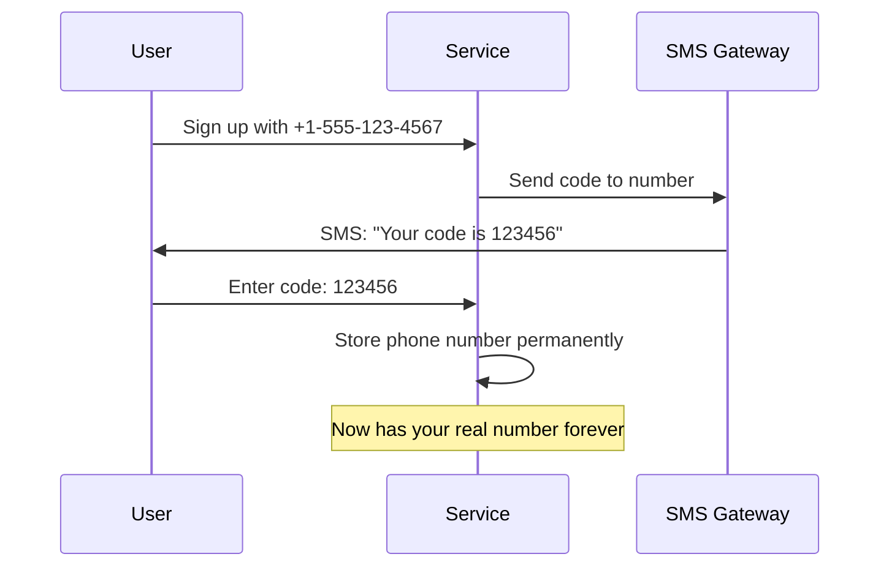

### 2.2 Privacy Implications

Once a service has your real phone number, they can:
- **Sell it** to data brokers and advertisers
- **Share it** with partners and affiliates
- **Leak it** in data breaches
- **Use it** to track you across services
- **Target you** with unwanted communications

### 2.3 Existing Workarounds and Their Limitations

Current privacy solutions fall short:

| Solution | Problems |
|----------|----------|
| Burner phones | Expensive, inconvenient, still trackable |
| VoIP numbers | Often blocked by services, not universally accepted |
| Temporary numbers | Lose access to accounts when number expires |
| Fake numbers | Doesn't pass verification, account suspension risk |

### 2.4 Design Requirements

An ideal solution must:
- ✅ **Preserve privacy**: Never reveal real phone numbers
- ✅ **Pass verification**: Work with existing systems
- ✅ **Prove legitimacy**: Cryptographically verifiable
- ✅ **Stay permanent**: Usable for account lifetime
- ✅ **Work offline**: No central dependency for verification

---

## 3. Protocol Overview

### 3.1 Core Concepts

The Hesha Protocol introduces three key innovations:

1. **Proxy Phone Numbers**: Privacy-preserving identifiers that look like real phone numbers
2. **Cryptographic Attestations**: Unforgeable proofs linking proxy numbers to verified phones
3. **Decentralized Verification**: Anyone can verify without contacting the issuer

### 3.2 High-Level Flow

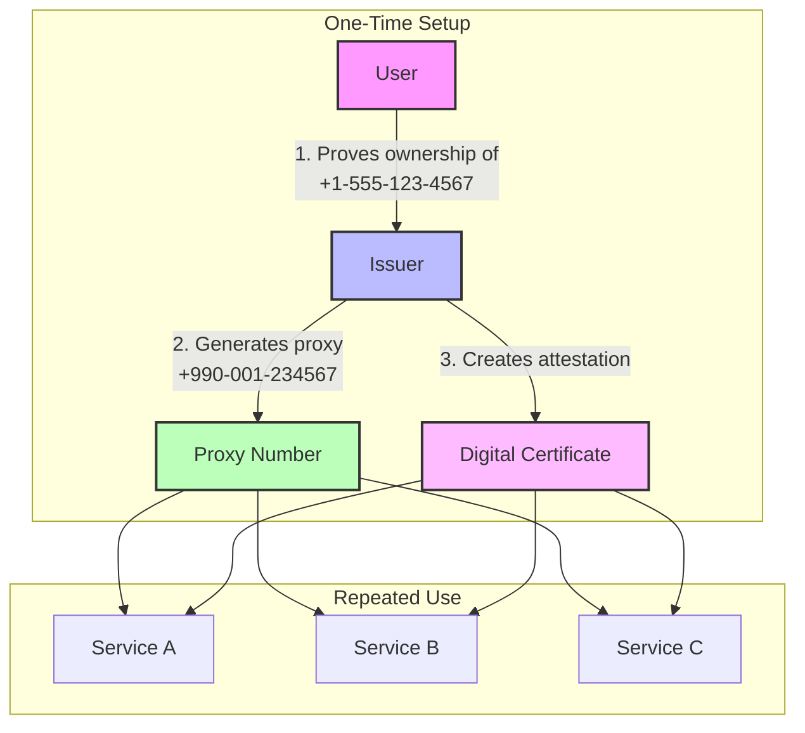

### 3.3 The Participants

1. **User**: Wants privacy while using services requiring phone verification
2. **Issuer**: Trusted entity that verifies phone ownership (carriers, privacy services)
3. **Service**: Any app or website requiring phone number verification
4. **Verifier**: Any entity checking attestation validity (often same as Service)

### 3.4 Trust Model

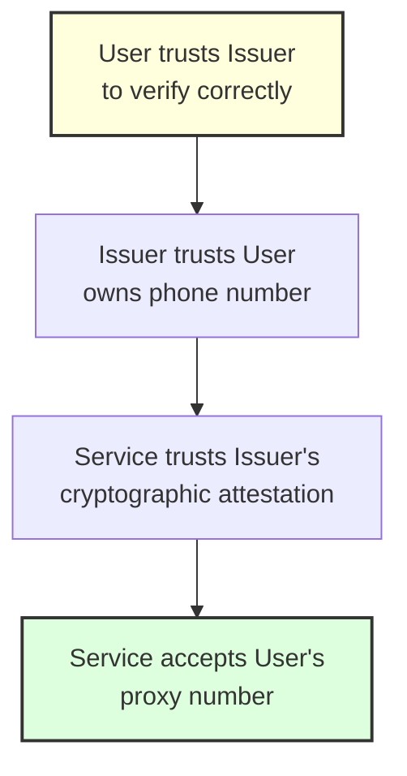

The protocol requires:
- Users trust issuers to properly verify phone ownership
- Services trust issuers' cryptographic signatures
- No trust needed between users and services
- No ongoing trust needed after attestation issuance

---

## 4. Cryptographic Design

### 4.1 Cryptographic Primitives

The Hesha Protocol employs industry-standard cryptography:

| Component | Algorithm | Purpose | Why This Choice |
|-----------|-----------|---------|-----------------|
| Digital Signatures | Ed25519 | Attestation integrity | Fast, secure, small signatures |
| Hashing | SHA-256 | Phone number privacy | Widely supported, quantum-resistant |
| Random Generation | OS CSPRNG | Nonce generation | Cryptographically secure entropy |
| Attestation Format | JWT | Token structure | Standard, library support |

### 4.2 Key Architecture

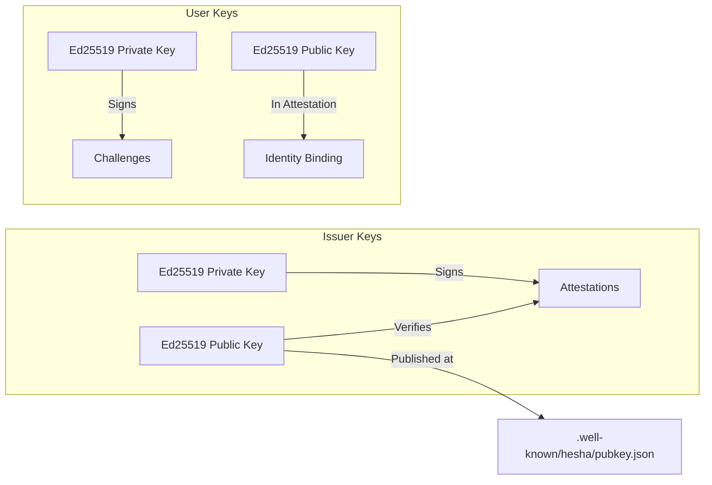

### 4.3 Security Properties

The protocol provides:

1. **Unforgeability**: Only the issuer can create valid attestations
2. **Non-repudiation**: Issuers cannot deny creating attestations
3. **Privacy**: Real phone numbers never appear in attestations
4. **Binding**: Attestations cryptographically tied to specific proxy numbers
5. **Transparency**: All verification uses public information

### 4.4 Cryptographic Binding (v1.1)

The binding proof prevents attestation tampering:

```
Message = phone_hash + "|" + user_pubkey + "|" + proxy_number + "|" + timestamp + "|hesha-binding-v2"
Binding = "sig:" + Base64URL(Ed25519-Sign(issuer_key, SHA256(Message)))
```

Note: The string "hesha-binding-v2" serves as:
- **Domain separator**: Ensures signatures are only valid for Hesha binding proofs
- **Version identifier**: The "v2" indicates signature-based proofs (v1 used HMAC)
- **Protocol identifier**: Prevents cross-protocol signature reuse

This ensures:
- Proxy numbers can't be substituted
- User keys can't be replaced  
- Timestamps can't be altered
- Entire attestation is cryptographically bound

---

## 5. Proxy Number Generation

### 5.1 The E.164 Challenge

Phone numbers follow the E.164 standard:
- Start with '+' followed by country code
- Maximum 15 digits total
- Each country controls its number space
- Must avoid conflicts with real numbers

### 5.2 The "00" Innovation

Hesha exploits a quirk in phone number allocation:

```
Standard numbers:  +1 555 123 4567  (US)
                   +44 20 7946 0958 (UK)
                   +33 1 42 86 82 00 (France)

Proxy numbers:     +1 00X XXX XXXX  (US proxy)
                   +44 00 XXXX XXXX (UK proxy)  
                   +990 00 XXXXXXXXX (Unassigned country code)
```

**Why "00" works:**
- No country assigns numbers starting with "00" after the country code
- Regulatory requirement in most countries (reserved for operator services)
- Visually distinctive while remaining valid E.164
- Compatible with existing phone number fields

### 5.3 Generation Algorithm

```mermaid
flowchart TD
    A[Input: Phone, User Key, Issuer, Scope, Nonce] --> B[Concatenate with pipes]
    B --> C[SHA-256 Hash]
    C --> D[Extract decimal digits]
    D --> E[Format: +{scope}00{digits}]
    E --> F{Examples}
    F -->|Scope: 1| G[+10012345678]
    F -->|Scope: 44| H[+440012345678]
    F -->|Scope: 233| I[+23300123456]
    F -->|Scope: 990| J[+99000123456789]
    
    style A fill:#fff,stroke:#333,stroke-width:2px
    style C fill:#fdd,stroke:#333,stroke-width:2px
    style E fill:#dfd,stroke:#333,stroke-width:2px
```

**Detailed Steps:**

```python
def generate_proxy_number(phone, user_pubkey, issuer_domain, scope, nonce):
    # Step 1: Create deterministic input
    input = f"{phone}|{user_pubkey}|{issuer_domain}|{scope}|{nonce}"
    
    # Step 2: Generate cryptographic hash
    hash_bytes = SHA256(input.encode('utf-8'))
    
    # Step 3: Extract digits from hash
    digits = ""
    for byte in hash_bytes:
        for hex_char in f"{byte:02x}":
            digit = int(hex_char, 16) % 10
            digits += str(digit)
            if len(digits) >= 20:  # More than enough
                break
    
    # Step 4: Format based on scope
    # All proxy numbers use the same format: +{scope}00{digits}
    digits_after_00 = max(8, min(10, 15 - len(scope) - 3))
    proxy = f"+{scope}00{digits[0:digits_after_00]}"
    
    return proxy
```

### 5.4 Collision Resistance

With 128-bit nonces:
- Collision probability: ~1 in 2^128
- At 1 million numbers/second: ~10^22 years to find collision
- Each user can have billions of unique proxy numbers
- No central coordination required

---

## 6. Attestation Structure

### 6.1 JWT Format

Attestations use JSON Web Tokens (JWT) for standardization:

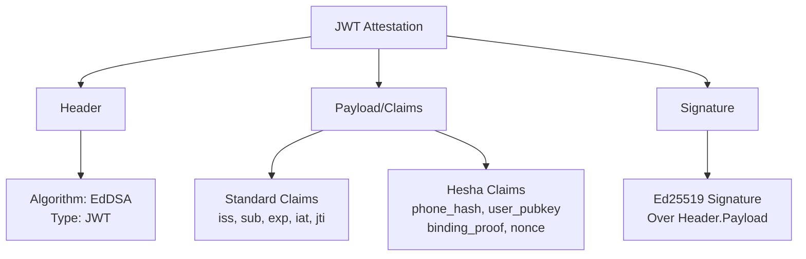

### 6.2 Attestation Claims

```json
{
  "iss": "issuer.example.com",           // Issuer domain
  "sub": "+99012345678901",              // Proxy number
  "iat": 1720000000,                     // Issued at (Unix timestamp)
  "exp": 1751536000,                     // Expiration timestamp
  "jti": "550e8400-e29b-41d4-a716-446655440000",  // Unique ID
  "phone_hash": "sha256:c775e7b7...",   // Hash of real number
  "user_pubkey": "MCowBQYDK2VwAy...",   // User's Ed25519 public key
  "binding_proof": "sig:SflKxwRJSM...",  // Cryptographic binding
  "nonce": "0123456789abcdef..."        // Generation nonce
}
```

### 6.3 Phone Hash Privacy

Real phone numbers are never stored. Instead:

```
Input: +1234567890 (with + prefix)
Normalized: 1234567890 (digits only)
Hash: SHA256(normalized) = c775e7b757ede630cd0aa1113bd102661ab38829ca52a6422ab782862f268646
Stored: "sha256:c775e7b757ede630cd0aa1113bd102661ab38829ca52a6422ab782862f268646"
```

This ensures:
- Phone numbers can't be reversed from hash
- Consistent hashing across implementations
- Privacy preserved in attestations

### 6.4 Trust Domain Delegation

For operational flexibility:

```json
{
  "iss": "api.example.com",      // Actual issuer
  "trust_domain": "example.com", // Trust root
  ...
}
```

Allows:
- Services on subdomains to issue attestations
- Central trust root at main domain
- Operational separation from trust establishment

---

## 7. Verification Flow

### 7.1 Complete Verification Sequence

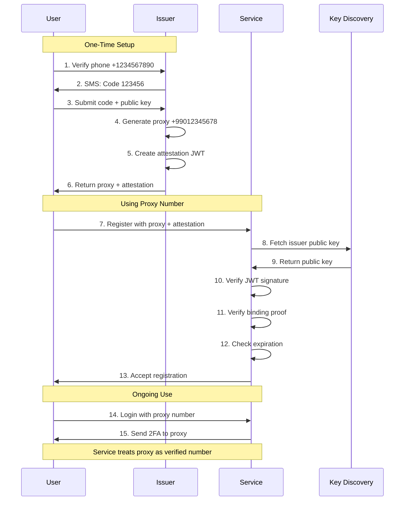

### 7.2 Verification Steps

**Step 1: Parse JWT**
```javascript
const [header, payload, signature] = jwt.split('.');
const claims = JSON.parse(base64Decode(payload));
```

**Step 2: Discover Issuer Key**
```javascript
const keyUrl = `https://${claims.iss}/.well-known/hesha/pubkey.json`;
const issuerKey = await fetch(keyUrl).then(r => r.json());
```

**Step 3: Verify JWT Signature**
```javascript
const valid = Ed25519.verify(
    message: header + '.' + payload,
    signature: base64Decode(signature),
    publicKey: issuerKey.public_key
);
```

**Step 4: Verify Binding Proof**
```javascript
const message = `${claims.phone_hash}|${claims.user_pubkey}|${claims.sub}|${claims.iat}|hesha-binding-v2`;
const bindingValid = verifyBindingSignature(claims.binding_proof, message, issuerKey);
```

**Step 5: Validate Claims**
```javascript
if (claims.exp < Date.now()/1000) throw "Expired";
if (claims.sub !== providedProxyNumber) throw "Mismatch";
```

### 7.3 Challenge-Response Verification

For high-security scenarios:

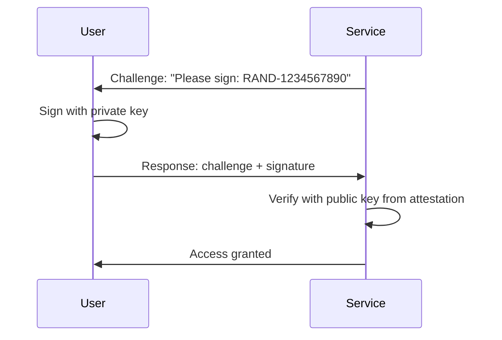

### 7.4 Offline Verification

Once an issuer's public key is cached, verification works offline:

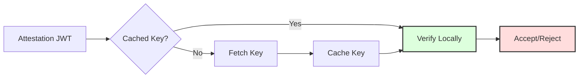

---

## 8. Security Analysis

### 8.1 Threat Model

The protocol defends against:

| Threat | Defense |
|--------|---------|
| Attestation forgery | Ed25519 signatures with public key verification |
| Proxy number substitution | Cryptographic binding proof |
| Phone number exposure | SHA-256 hashing (one-way) |
| Replay attacks | JWT IDs (jti) and expiration times |
| Key compromise | Key rotation support, limited attestation lifetime |
| Privacy correlation | Different proxy numbers for different services |

### 8.2 Security Properties

**Property 1: Unforgeability**
- Attestations require issuer's private key
- Ed25519 provides 128-bit security level
- Quantum-resistant hash functions

**Property 2: Privacy Preservation**
```
Real Number → SHA-256 → Hash (one-way)
Real Number → Algorithm → Proxy (deterministic but irreversible)
```

**Property 3: Binding Integrity**
- All attestation components cryptographically linked
- Tampering with any field invalidates signature
- Prevents mix-and-match attacks

### 8.3 Attack Scenarios

**Scenario 1: Malicious Service**
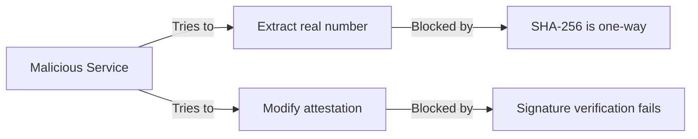

**Scenario 2: Compromised Issuer**
- Limited damage: can only issue new attestations
- Cannot modify existing attestations
- Cannot extract real numbers from hashes
- Detected via Certificate Transparency-like systems

**Scenario 3: User Key Compromise**
- Attacker can prove ownership of attestation
- Cannot create new attestations
- Cannot modify proxy number
- Revocation through issuer required

### 8.4 Privacy Analysis

The protocol reveals:
- ✅ Proxy number (by design)
- ✅ Issuer identity (necessary for trust)
- ✅ Attestation validity period
- ❌ Real phone number (protected by hash)
- ❌ User location or carrier
- ❌ Other proxy numbers user has

---

## 9. Implementation Guide

### 9.1 For Issuers

**Basic Issuer Flow:**

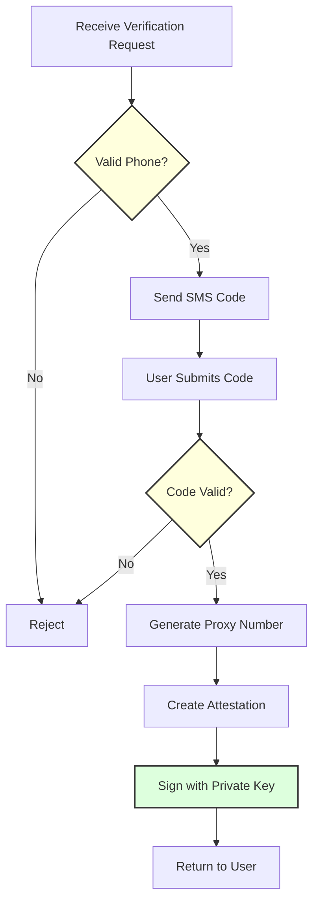

**Key Management:**
```rust
// Generate issuer keys (one time)
let keypair = Ed25519::generate();
save_private_key_securely(keypair.private);
publish_public_key(keypair.public); // At /.well-known/hesha/pubkey.json

// Sign attestations
let attestation = create_attestation(phone, proxy, user_key);
let signature = sign_jwt(attestation, keypair.private);
```

**Rate Limiting:**
- Per phone number: 5 attestations per day
- Per IP address: 20 requests per hour
- Per user key: 10 attestations total

### 9.2 For Services

**Integration Steps:**

1. **Update Registration Form:**
```html
<input type="tel" name="phone" placeholder="Phone or Proxy Number">
<input type="file" name="attestation" accept=".jwt,.hesha">
<small>Privacy: Use a Hesha proxy number</small>
```

2. **Verify Attestations:**
```javascript
async function verifyHeshaNumber(proxyNumber, attestationJWT) {
    try {
        // Parse and verify
        const attestation = await heshaVerify(attestationJWT);
        
        // Check proxy matches
        if (attestation.proxy_number !== proxyNumber) {
            throw new Error("Number mismatch");
        }
        
        // Check not expired
        if (attestation.isExpired()) {
            throw new Error("Attestation expired");
        }
        
        // Accept as verified
        return {
            verified: true,
            issuer: attestation.issuer,
            expires: attestation.expiry
        };
    } catch (error) {
        // Fallback to traditional SMS verification
        return traditionalSMSVerification(proxyNumber);
    }
}
```

3. **Handle Both Number Types:**
```javascript
function isHeshaProxy(number) {
    // Check for 00 pattern after country code
    return /^\+\d{1,4}00\d+$/.test(number);
}

if (isHeshaProxy(phoneNumber) && attestation) {
    // Verify via Hesha
    await verifyHeshaNumber(phoneNumber, attestation);
} else {
    // Traditional SMS flow
    await sendSMSVerification(phoneNumber);
}
```

### 9.3 For Users

**Getting Started:**

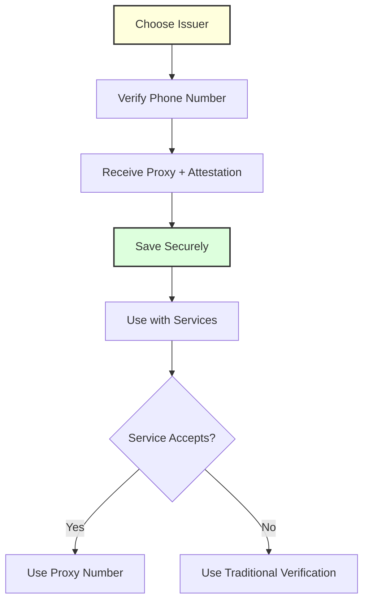

**Best Practices:**
- Use different proxy numbers for different purposes
- Keep attestations backed up securely
- Renew before expiration
- Only share with services you trust

---

## 10. Real-World Applications

### 10.1 Messaging Apps

**Signal/WhatsApp/Telegram Integration:**
- Users register with proxy numbers
- Apps verify via Hesha attestation
- Messages route normally
- Contact discovery works with proxy numbers

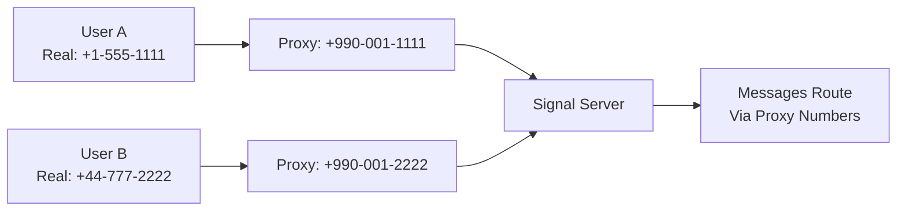

### 10.2 Financial Services

**Banking Applications:**
- Know Your Customer (KYC) compliance maintained
- Reduces SIM swap attack surface
- Enables privacy-preserving 2FA
- Audit trail via attestations

### 10.3 Healthcare

**Patient Privacy:**
- HIPAA compliance enhanced
- Appointment reminders without exposing numbers
- Prescription notifications stay private
- Emergency contact via proxy

### 10.4 E-commerce

**Marketplace Safety:**
- Buyers and sellers communicate safely
- Numbers not exposed in transactions
- Reduces post-transaction harassment
- Platform can verify all parties

### 10.5 Dating Apps

**Safe Connections:**
```
Real Number → Dating Proxy → Match Communication
                    ↓
             If relationship progresses
                    ↓
              Share real number
```

---

## 11. Future Work

### 11.1 Protocol Enhancements

1. **Zero-Knowledge Proofs**: Prove phone ownership without revealing even hashed number
2. **Attribute-Based Attestations**: Prove properties (e.g., "US number") without specifics
3. **Revocation Infrastructure**: Efficient revocation checking
4. **Cross-Issuer Federation**: Mutual recognition between issuers

### 11.2 Ecosystem Development

1. **Mobile OS Integration**: Native support in iOS/Android
2. **Carrier Partnerships**: Direct carrier issuance
3. **Regulatory Framework**: Working with telecom regulators
4. **W3C Standardization**: Web standard for attestation handling

### 11.3 Advanced Privacy Features

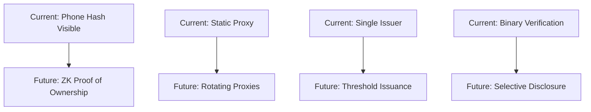

---

## 12. Conclusion

The Hesha Protocol provides a practical solution to phone number privacy while maintaining the security benefits of phone verification. By introducing cryptographically provable proxy numbers, we enable users to participate in the digital economy without sacrificing their privacy.

Key achievements:
- ✅ **Privacy by Design**: Real numbers never exposed
- ✅ **Backward Compatible**: Works with existing systems
- ✅ **Cryptographically Secure**: Unforgeable attestations
- ✅ **Decentralized Verification**: No central point of failure
- ✅ **User Empowerment**: Control over identity disclosure

The protocol is ready for implementation, with reference code available and early adopters beginning integration. We invite the community to join us in building a more private digital future.

### Acknowledgments

We thank the cryptography community for feedback on our design, early adopters for real-world testing, and privacy advocates for inspiring this work.

### References

1. ITU-T E.164: The international public telecommunication numbering plan
2. Bernstein, D.J., et al. "Ed25519: high-speed high-security signatures"
3. RFC 7519: JSON Web Token (JWT)
4. RFC 8555: Automatic Certificate Management Environment (ACME)
5. Signal Protocol: End-to-end encryption specification

---

## Appendix A: Technical Specifications

### A.1 Proxy Number Format Regex
```
All proxy numbers: ^\+\d{1,4}00\d{8,10}$

Examples:
- US (scope 1):     ^\+100\d{10}$
- UK (scope 44):    ^\+4400\d{9,10}$
- Ghana (scope 233): ^\+23300\d{8,9}$
- Unassigned (990): ^\+99000\d{8}$
```

### A.2 Attestation JWT Example
```
eyJhbGciOiJFZERTQSIsInR5cCI6IkpXVCJ9.eyJpc3MiOiJpc3N1ZXIuZXhhbXBsZS5jb20iLCJzdWIiOiIrOTkwMTIzNDU2Nzg5MDEiLCJpYXQiOjE3MjAwMDAwMDAsImV4cCI6MTc1MTUzNjAwMCwianRpIjoiNTUwZTg0MDAtZTI5Yi00MWQ0LWE3MTYtNDQ2NjU1NDQwMDAwIiwicGhvbmVfaGFzaCI6InNoYTI1NjpjNzc1ZTdiNzU3ZWRlNjMwY2QwYWExMTEzYmQxMDI2NjFhYjM4ODI5Y2E1MmE2NDIyYWI3ODI4NjJmMjY4NjQ2IiwidXNlcl9wdWJrZXkiOiJNQ293QlFZREsyVndBeUVBYTdic2EyZUk3VDZ3OVA2S1ZKZEx2bVNHcTJ1UG1UcXoyUjBSQkFsNlIyRT0iLCJiaW5kaW5nX3Byb29mIjoic2lnOlNmbEt4d1JKU01lS0tGMlFUNGZ3cE1lSmYzNlBPazZ5SlZfYWRRc3N3NWMiLCJub25jZSI6IjAxMjM0NTY3ODlhYmNkZWYwMTIzNDU2Nzg5YWJjZGVmIn0.SflKxwRJSMeKKF2QT4fwpMeJf36POk6yJV_adQssw5c
```

### A.3 Public Key Discovery Response
```json
{
    "public_key": "MCowBQYDK2VwAyEAa7bsa2eI7T6w9P6KVJdLvmSGq2uPmTqz2R0RBAl6R2E=",
    "algorithm": "Ed25519",
    "key_id": "2024-01-01",
    "created_at": "2024-01-01T00:00:00Z"
}
```

---

*The Hesha Protocol: Privacy is not optional.*